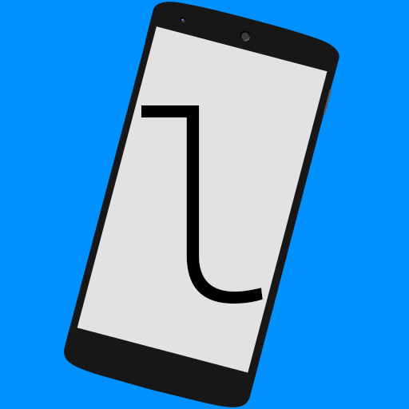

<h1 align="center">
   
  LibreConnect
</h1>

  An application for seamless communication and integration between computers and mobile devices, developed with a strong focus on user privacy. LibreConnect provides a unified ecosystem that bridges the gap between your devices while ensuring your data remains under your control.

---

## Core Philosophy: Privacy by Design

LibreConnect is built from the ground up with privacy as its foundational principle. Unlike many similar solutions, it does not rely on intermediary servers or cloud infrastructure.

- **Local Network Only:** All communication occurs exclusively within your local network.
- **Peer-to-Peer (P2P):** Devices connect directly to each other, eliminating third-party bottlenecks and potential points of interception.
- **End-to-End Encryption (E2E):** All data transmitted between devices is encrypted end-to-end, providing an additional layer of security even in trusted local environments.
- **Open Source:** The codebase is entirely transparent and open for auditing, ensuring no hidden telemetry or data collection.

---

## Key Features

### Device Info
Get an instant overview of your connected devices.
- Monitor hostname and device identification.
- Real-time battery level tracking for both mobile devices and computers (where hardware permits).
*Placeholder: [Device Info Screenshot]*

### Virtual Camera
Transform your smartphone into a high-quality webcam for your computer. The system recognizes the phone as a native camera device.
- Adjustable resolution and orientation.
- Status notifications on the mobile device with quick-disable functionality.
*Placeholder: [Virtual Camera Screenshot]*

### Virtual Microphone
Use your mobile device as a wireless microphone for your desktop.
- Seamless integration with system audio inputs.
- Active status notifications for privacy awareness.
*Placeholder: [Virtual Microphone Screenshot]*

### File Manager
Access and manage your Android file system directly from your desktop.
- Browse files with thumbnail previews.
- Open mobile files directly on your computer.
- Drag-and-drop support for near-instant file transfers.
*Placeholder: [File Manager Screenshot]*

### Share Provider
Integrated with the Android system share menu, allowing you to send files, images, or links from your phone to your computer instantly.
- Configurable destination folders.
*Placeholder: [Share Provider Screenshot]*

### Notification Sync
Receive and manage mobile notifications on your desktop.
- View all active notifications in the desktop UI.
- Dismiss notifications on your phone directly from your computer.
*Placeholder: [Notification Sync Screenshot]*

### Clipboard Sync
Synchronize your clipboard across all devices.
- **Desktop to Mobile:** Automatic synchronization.
- **Mobile to Desktop:** Manual synchronization via Quick Settings tile (due to Android security restrictions).
- Optional manual-only mode for both platforms.
*Placeholder: [Clipboard Sync Screenshot]*

### SMS/MMS Messaging
Read and reply to text messages from your computer.
- Full conversation history access.
- Seamless message sending as if using the phone directly.
*Placeholder: [SMS/MMS Screenshot]*

### Media Remote
Bidirectional multimedia control for both computers and mobile devices.
- Synchronized metadata: Title, Artist, Album, Cover Art, and Playback Position.
- System-level media notifications for quick control without opening the app.
- Remote volume adjustment.
*Placeholder: [Media Remote Screenshot]*

### Remote Keyboard
Utilize your mobile device as a remote keyboard for your computer.
*Placeholder: [Remote Keyboard Screenshot]*

### Presenter Mode
Control slideshow presentations remotely.
- Start/End presentation mode.
- Slide navigation.
*Placeholder: [Presenter Mode Screenshot]*

### Find My Phone
Locate your misplaced mobile device from your computer.
- Triggers an audible alert at maximum volume.
- Overrides "Do Not Disturb" and silent modes.
*Placeholder: [Find My Phone Screenshot]*

### Streamer Mode
A built-in privacy feature designed for those who share or stream their screens.
- Instantly masks sensitive data within the application.
- Replaces hostnames, IP addresses, and contact information with generic placeholders (e.g., "Connected Device", "Unknown Contact") to prevent accidental disclosure.
*Placeholder: [Streamer Mode Screenshot]*

---

## Supported Platforms

LibreConnect supports the platforms listed below. For the latest binaries and installation packages, please visit the [Releases](https://github.com/ppaluchowski64/LibreConnect/releases) page.

| Operating System | Package Format | Supported Architectures |
|------------------|----------------|-------------------------|
| **Windows**      | .msi           | x86_64, ARM64           |
| **Linux**        | .deb, .rpm, .pkg.tar.zst, .tar.gz | x86_64, ARM64 |
| **macOS**        | .dmg           | ARM64 (Apple Silicon)   |
| **Android**      | .apk           | ARM64                   |

*Note: iOS is currently not supported due to platform restrictions regarding background processes and permissions.*

---

## Getting Started

### Initial Setup
1. Install and launch LibreConnect on both your computer and your mobile device.
2. Ensure both devices are connected to the same local network.
3. On the mobile device, grant all requested permissions to ensure full functionality.

### Pairing Process
1. In the desktop application, your mobile device should appear with its name and an Android icon.
2. Select the device and click **Pair** (or double-click the device entry).
3. A 6-digit verification code will appear on the mobile device.
4. Enter this code into the desktop application.
5. Complete the second factor of authentication by confirming the pairing request on your mobile device.

*Placeholder: [Pairing Process Screenshot 1]*
*Placeholder: [Pairing Process Screenshot 2]*

---

## Contributing

We welcome contributions from the community. If you are interested in improving LibreConnect, please refer to our [CONTRIBUTING.md](CONTRIBUTING.md) file for guidelines on how to get started.

---

## License

LibreConnect is released under the **GNU GPL v3.0** license. See the [LICENSE](LICENSE) file for more details.
